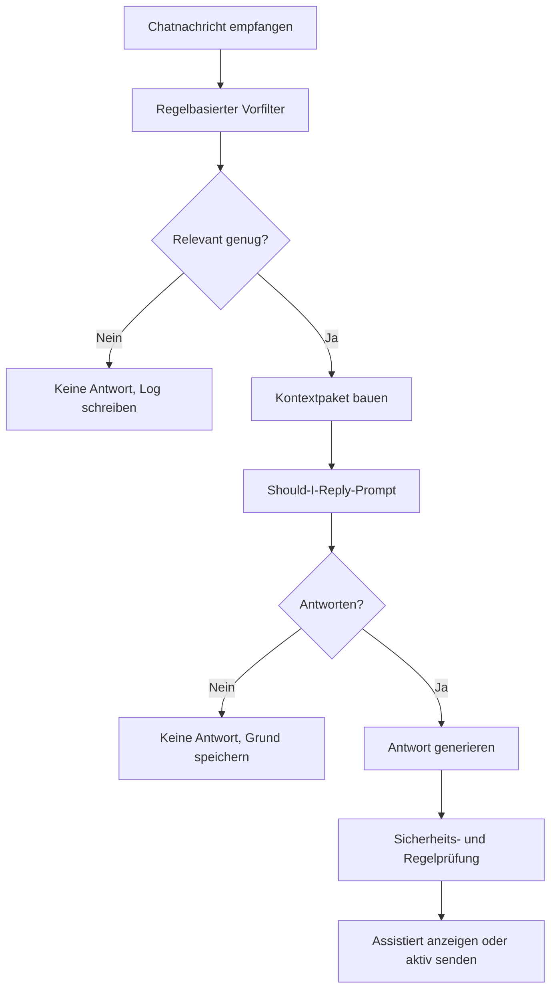
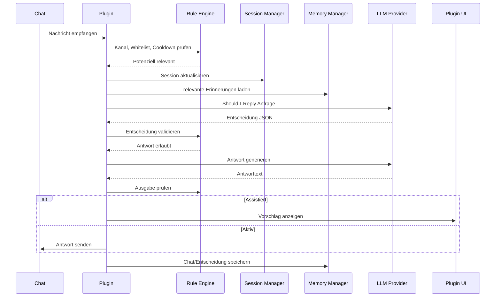

y
# Konzept: FFXIV Dalamud Plugin mit LLM-Companion

## 1. Kurzbeschreibung

Dieses Konzept beschreibt ein Dalamud-Plugin für Final Fantasy XIV, das einen KI-gestützten Companion in den Spielchat integriert. Der Companion soll nicht wie ein nüchterner Assistent wirken, sondern wie ein eigener Charakter: ein Spieler-ähnlicher Gesprächspartner mit Name, Persönlichkeit, Stil, Erinnerungen und situationsabhängigem Verhalten.

Das Plugin hört ausgewählte Chat-Kanäle mit, erkennt relevante Gesprächssituationen, unterscheidet Personen und Gruppenkontexte, verwaltet Sitzungen und kann mithilfe eines angebundenen Large Language Models auf Nachrichten reagieren. Die Reaktionen erfolgen abhängig von Whitelist, Nähe, Gesprächskontext, Persona-Regeln und einer vorgeschalteten Entscheidungsschicht, die prüft, ob überhaupt geantwortet werden sollte.

Ziel ist kein simpler Auto-Responder, sondern ein kontextbewusster Companion, der versteht:

* Wer spricht?
* Wer ist gemeint?
* Ist die Persona angesprochen?
* Ist der lokale Spieler angesprochen?
* Handelt es sich um ein Gruppengespräch?
* Muss eine Antwort kommen oder wäre Schweigen natürlicher?
* Welche Erinnerung ist relevant?
* Welche Tonalität passt zu dieser Person oder Gruppe?

Das Plugin soll in Version 1 die Kanäle `Say`, `Tell` und `Party` unterstützen. Antworten sollen in demselben Kanal erfolgen, aus dem die auslösende Nachricht stammt.

---

## 2. Zielbild

Das Plugin soll sich anfühlen wie ein zusätzlicher Charakter, der den Spieler begleitet. Dieser Charakter kann verschiedene Personas besitzen, zum Beispiel:

* neutral
* frech
* RP-orientiert
* freundlich
* zurückhaltend
* sarkastisch
* support-orientiert
* lore-nah
* sozial, aber nicht aufdringlich

Der Companion soll nicht jede Nachricht kommentieren. Er soll lernen beziehungsweise anhand von Kontext, Regeln und Gedächtnis einschätzen, ob eine Antwort sinnvoll ist. Besonders wichtig ist, dass er in Gruppengesprächen nicht wahllos dazwischenredet, sondern erkennt, ob er selbst, der Spieler oder jemand anderes gemeint ist.

---

## 3. Grundprinzipien

### 3.1 Natürlichkeit vor Aktivität

Das Plugin soll lieber einmal zu wenig als einmal zu viel antworten. Ein Companion, der jede zweite Nachricht kommentiert, wirkt schnell wie ein sehr motivierter NPC auf Espresso.

Daher gilt:

* Antworten nur bei ausreichend hoher Relevanz.
* Schweigen ist ein gültiges Ergebnis.
* Gruppengespräche müssen nicht immer eine Companion-Reaktion erzeugen.
* Der Companion soll auf direkte Ansprache stärker reagieren als auf allgemeinen Smalltalk.

### 3.2 Kontext vor Keyword-Erkennung

Die Erkennung soll nicht nur auf festen Trigger-Wörtern basieren. Der Name der Persona, der Name des Spielers, Tell-Nachrichten, Nähe, Zielausrichtung, Gesprächshistorie und aktive Session sollen zusammen betrachtet werden.

Beispiel:

```text
Alice: Maya, was meinst du dazu?
```

Sehr hohe Wahrscheinlichkeit, dass die Persona gemeint ist.

```text
Alice: Was meint ihr dazu?
Bob: Hm, ich weiß nicht.
```

Mittelmäßige Wahrscheinlichkeit. Der Companion kann antworten, muss aber nicht.

```text
Alice: Kabu, kommst du mit?
```

Wahrscheinlich ist der Spieler gemeint, nicht zwingend die Persona.

### 3.3 Gedächtnis mit Grenzen

Das Plugin speichert Informationen in SQLite. Dabei wird nicht nur roher Chatverlauf gespeichert, sondern das Gedächtnis wird in verschiedene Memory-Typen getrennt.

Geplante Memory-Typen:

| Typ                | Zweck                                                                 |
| ------------------ | --------------------------------------------------------------------- |
| Kurzzeitgedächtnis | Aktuelle Session, letzte Nachrichten, aktive Gesprächsdynamik         |
| Langzeitgedächtnis | Wiederkehrende Interessen, Beziehungen, bekannte Themen               |
| Faktenmemory       | Name, World, Gruppen, Status, bekannte Eigenschaften                  |
| Stilmemory         | Gewünschter Ton, RP-Stil, Casual-Stil, bevorzugte Sprache             |
| Konfliktmemory     | Grenzen, negative Erfahrungen, Personen, bei denen Vorsicht nötig ist |

### 3.4 Kontrolle durch Nutzer

Das Plugin bietet zwei Betriebsmodi:

| Modus      | Verhalten                                                                         |
| ---------- | --------------------------------------------------------------------------------- |
| Assistiert | Das Plugin schlägt Antworten im UI vor. Der Nutzer entscheidet, ob gesendet wird. |
| Aktiv      | Das Plugin antwortet selbstständig nach Regeln.                                   |

Ein vollständig passiver Modus kann intern trotzdem sinnvoll sein, ist aber nicht Kernanforderung. Für Entwicklung und Debugging sollte es jedoch möglich sein, automatische Antworten temporär zu deaktivieren.

---

## 4. Funktionsumfang

## 4.1 Chat-Kanäle

Das Plugin hört auf folgende Chat-Kanäle:

* Say
* Tell
* Party

Das Plugin antwortet in dem Kanal, aus dem die relevante Nachricht stammt.

Beispiele:

| Eingang | Antwortkanal            |
| ------- | ----------------------- |
| Say     | Say                     |
| Tell    | Tell an dieselbe Person |
| Party   | Party                   |

### Nicht in Version 1 enthalten

* Free Company
* Linkshell
* Cross-world Linkshell
* Alliance
* Novice Network
* Shout
* Yell

Diese Kanäle können später ergänzt werden, sollten aber nicht zum Startumfang gehören, da sie schnell mehr Datenschutz-, Kontext- und Spam-Probleme erzeugen.

---

## 4.2 LLM-Anbieter

Das Plugin soll mehrere LLM-Anbieter unterstützen. Anbieter sind auswählbar, aber es gibt keinen automatischen Fallback.

Geplante Anbieter:

* OpenAI API
* DeepSeek API
* Optional später: OpenRouter
* Optional später: Anthropic
* Optional später: Google Gemini
* Optional später: lokale Anbieter wie Ollama

Für Version 1 reichen OpenAI und DeepSeek.

### Provider-Konzept

Jeder Anbieter bekommt ein eigenes Template mit eigenen Einstellungen.

Beispielhafte Provider-Einstellungen:

```json
{
  "providerId": "openai",
  "displayName": "OpenAI",
  "apiBaseUrl": "https://api.openai.com/v1",
  "apiKey": "...",
  "model": "gpt-4.1-mini",
  "temperature": 0.8,
  "maxTokens": 350,
  "timeoutSeconds": 20,
  "systemPromptTemplateId": "default_companion",
  "replyDecisionTemplateId": "default_should_reply"
}
```

```json
{
  "providerId": "deepseek",
  "displayName": "DeepSeek",
  "apiBaseUrl": "https://api.deepseek.com",
  "apiKey": "...",
  "model": "deepseek-chat",
  "temperature": 0.8,
  "maxTokens": 350,
  "timeoutSeconds": 20,
  "systemPromptTemplateId": "default_companion",
  "replyDecisionTemplateId": "default_should_reply"
}
```

### Streaming-Entscheidung

Für Version 1 wird empfohlen:

* Keine Streaming-Ausgabe in den Spielchat.
* Antwort erst vollständig generieren lassen.
* Danach Sicherheits- und Regelprüfung.
* Erst dann senden oder im Assistiert-Modus vorschlagen.

Streaming bedeutet, dass eine Antwort stückweise eintrifft. Für ein normales Chatfenster ist das meist unpraktisch, weil der finale Text erst geprüft werden sollte, bevor er ausgegeben wird.

Optional für spätere Versionen:

* Streaming nur im Plugin-Fenster anzeigen.
* Finale Antwort nach Abschluss normal senden.

---

## 4.3 Persona-System

Das Persona-System ist der Kern des Companions. Eine Persona definiert, wie das LLM wirken soll.

### Persona-Eigenschaften

Eine Persona enthält:

* Name
* Beschreibung
* Sprachstil
* Persönlichkeit
* Humor-Level
* RP-Level
* Antwortlänge
* Umgang mit Fremden
* Umgang mit Freunden
* Umgang mit Gruppen
* Tabuthemen
* erlaubte Chat-Kanäle
* Standardmodell / Provider
* System Prompt
* Regeln für direkte Ansprache
* Regeln für indirekte Ansprache

### Beispiel-Persona

```json
{
  "name": "Maya",
  "style": "spielerisch, warm, leicht frech, in-character",
  "roleplayLevel": 0.65,
  "humorLevel": 0.7,
  "verbosity": "kurz bis mittel",
  "defaultLanguage": "de",
  "replyAsPlayerLikeCharacter": true,
  "avoidAssistantTone": true,
  "allowedChannels": ["Say", "Tell", "Party"]
}
```

### Persona-Modi

Eine Persona kann mehrere Modi besitzen:

| Modus         | Beschreibung                                   |
| ------------- | ---------------------------------------------- |
| Neutral       | Ruhiger, weniger auffällig, weniger RP         |
| Frech         | Verspielter, mehr Humor, aber nicht verletzend |
| RP-Modus      | Spricht stärker in-character                   |
| Support-Modus | Hilfsbereit, erklärender, weniger Witze        |
| Still-Modus   | Antwortet nur bei direkter Ansprache           |

Diese Modi können entweder manuell gewählt oder situationsabhängig gesetzt werden.

Beispiel:

* In Party eher kompakt.
* In Say bei RP-Kontakten mehr in-character.
* In Tell persönlicher und direkter.

---

## 4.4 Personen, Gruppen und Whitelist

Das Plugin reagiert nur auf Personen, die in einer Whitelist oder passenden Gruppe eingetragen sind.

### Identität

Personen sollten eindeutig über folgende Daten identifiziert werden:

```text
CharacterName@World
```

Beispiel:

```text
Alice Example@Light
```

### Personengruppen

Gruppen dienen nicht nur dem Zugriff, sondern auch der Tonalität.

Beispiele:

| Gruppe      | Verhalten                                  |
| ----------- | ------------------------------------------ |
| Freunde     | Locker, vertraut, häufiger antworten       |
| RP-Kontakte | Mehr in-character, achtet auf RP-Kontext   |
| Party       | Kürzer, praktischer, weniger ausschweifend |
| Vorsichtig  | Antwortet seltener, neutraler Ton          |
| Ignorieren  | Keine Reaktion                             |

### Gruppenregeln

Jede Gruppe kann Regeln definieren:

* darf Companion ansprechen
* darf automatische Antworten auslösen
* nur Assistiert-Modus
* bevorzugte Persona
* bevorzugte Sprache
* maximale Antwortfrequenz
* Memory aktiv / inaktiv
* Gruppengedächtnis aktiv / inaktiv

### Zusammenführbare Erinnerungen

Pro Person wird ein getrenntes Gedächtnis geführt. Wenn Personen aber regelmäßig zusammen in Sessions auftreten, kann ein Gruppengedächtnis entstehen.

Beispiel:

```text
Alice@Light und Bob@Light sprechen oft gemeinsam mit der Persona.
Das Plugin erkennt wiederkehrende Gruppensessions.
Es erstellt ein Gruppengedächtnis: Gruppe "Alice + Bob".
```

Das Gruppengedächtnis ersetzt nicht die einzelnen Profile, sondern ergänzt sie.

---

## 4.5 Chat-Kontext und Gesprächserkennung

Das Plugin soll drei Hauptsituationen unterscheiden:

1. Jemand spricht direkt den Spieler an.
2. Jemand spricht direkt die Persona / das LLM an.
3. Es handelt sich um ein allgemeines Gruppengespräch.

### Eingangssignale

Für die Interpretation werden mehrere Signale kombiniert:

| Signal                                    | Bedeutung                                        |
| ----------------------------------------- | ------------------------------------------------ |
| Persona-Name erwähnt                      | Sehr starkes Signal für direkte Ansprache        |
| Spielername erwähnt                       | Signal, dass der Spieler gemeint sein könnte     |
| Tell-Nachricht                            | Starkes Signal für direkte Kommunikation         |
| Nähe                                      | Nur relevante nahe Spieler werden berücksichtigt |
| Aktuelles Target                          | Kann zeigen, wer im Fokus steht                  |
| Blickrichtung / Target der anderen Person | Optional, falls zuverlässig erfassbar            |
| Gesprächshistorie                         | Erkennt laufende Konversation                    |
| Session-Mitglieder                        | Erkennt, wer gerade Teil des Gesprächs ist       |
| Vorherige Antwort der Persona             | Erhöht Kontextbindung                            |
| Fragezeichen / direkte Frage              | Erhöht Antwortwahrscheinlichkeit                 |
| Gruppendynamik                            | Senkt oder erhöht Antwortwahrscheinlichkeit      |

### Beispielbewertung

```json
{
  "message": "Maya, was denkst du?",
  "speaker": "Alice@Light",
  "channel": "Say",
  "personaMentioned": true,
  "playerMentioned": false,
  "isTell": false,
  "speakerNearby": true,
  "activeSession": true,
  "replyLikelihood": 0.94
}
```

```json
{
  "message": "Kabu, kommst du?",
  "speaker": "Alice@Light",
  "channel": "Party",
  "personaMentioned": false,
  "playerMentioned": true,
  "isTell": false,
  "speakerNearby": true,
  "activeSession": true,
  "replyLikelihood": 0.35
}
```

Im zweiten Beispiel sollte die Persona wahrscheinlich nicht automatisch antworten, weil eher der Spieler gemeint ist.

---

## 4.6 Session Manager

Der Session Manager verwaltet laufende Gespräche.

Eine Session ist ein zeitlich und räumlich begrenzter Gesprächskontext.

### Session-Daten

```json
{
  "sessionId": "uuid",
  "channel": "Say",
  "zoneId": 123,
  "startedAt": "2026-05-24T18:30:00Z",
  "lastActivityAt": "2026-05-24T18:34:10Z",
  "participants": [
    "Alice@Light",
    "Bob@Light"
  ],
  "nearbyPlayers": [
    "Alice@Light",
    "Bob@Light",
    "Cecil@Light"
  ],
  "mainSpeaker": "Alice@Light",
  "currentTopic": "Treffen vor dem Dungeon",
  "mood": "locker",
  "personaAddressedRecently": true,
  "replyCooldownUntil": "2026-05-24T18:34:30Z"
}
```

### Session-Start

Eine Session kann starten, wenn:

* eine Whitelist-Person in einem überwachten Kanal schreibt
* eine Nachricht die Persona direkt erwähnt
* eine Tell-Nachricht von einer Whitelist-Person kommt
* mehrere bekannte Personen in der Nähe aktiv sprechen
* der Companion gerade geantwortet hat und eine Folgeantwort kommt

### Session-Ende

Eine Session endet oder wird inaktiv, wenn:

* eine definierte Zeit keine relevante Nachricht kommt
* die beteiligten Personen nicht mehr in der Nähe sind
* die Zone gewechselt wird
* der Chat-Kanal nicht mehr aktiv ist
* der Nutzer manuell beendet

Empfohlene Standardwerte:

| Einstellung                         | Standard       |
| ----------------------------------- | -------------- |
| Session Idle Timeout                | 5 Minuten      |
| Session Nearby Timeout              | 60 Sekunden    |
| Maximale Session-Historie im Prompt | 20 Nachrichten |
| Maximale Session-Dauer aktiv        | 30 Minuten     |

### Join-/Leave-Erkennung

Da das Spiel nicht immer explizit sagt, wer einer Unterhaltung beitritt oder sie verlässt, wird Join/Leave indirekt erkannt.

Eine Person gilt als Session-Teilnehmer, wenn:

* sie eine relevante Nachricht schreibt
* sie nahe genug am Spieler ist
* sie in den letzten Minuten aktiv war
* sie auf der Whitelist steht oder von einer Whitelist-Gruppe toleriert wird

Eine Person gilt als abwesend, wenn:

* sie nicht mehr in Nearby Players auftaucht
* sie lange nicht mehr geschrieben hat
* sie die Zone verlassen hat
* sie nicht mehr zum aktiven Kontext passt

---

## 4.7 Nearby Player System

Das Plugin berücksichtigt nur Spieler in der Nähe. Die Reichweite ist einstellbar.

### Einstellungen

| Einstellung            | Beschreibung                |
| ---------------------- | --------------------------- |
| Nearby-Erkennung aktiv | Schaltet Näheprüfung an/aus |
| Radius                 | Entfernung in Yalms         |
| Standardradius         | z. B. 30 Yalms              |
| Mindestnähe für Say    | z. B. 30 Yalms              |
| Mindestnähe für Party  | optional weniger streng     |
| Mindestnähe für Tell   | nicht nötig, da direkt      |

### Warum Nähe wichtig ist

Nähe hilft bei:

* Erkennen relevanter Say-Gespräche
* Gruppensession-Erkennung
* Vermeidung falscher Antworten
* Targeting
* Kontextbewertung

### Nearby-Snapshot

Das Plugin sollte regelmäßig einen Snapshot der nahen Spieler erstellen.

```json
{
  "timestamp": "2026-05-24T18:30:00Z",
  "localPlayer": "Kabu@Light",
  "players": [
    {
      "name": "Alice",
      "world": "Light",
      "distance": 4.2,
      "isTargeted": false,
      "isWhitelisted": true
    },
    {
      "name": "Bob",
      "world": "Light",
      "distance": 8.7,
      "isTargeted": false,
      "isWhitelisted": true
    }
  ]
}
```

---

## 4.8 Targeting

Das Plugin soll die Person targetten können, die es gerade anspricht.

### Regeln für Targeting

Targeting erfolgt nur, wenn:

* Targeting aktiviert ist
* die Person eindeutig identifiziert wurde
* die Person in der Nähe ist
* die Confidence hoch genug ist
* der Nutzer nicht in einem blockierten Zustand ist
* keine gefährliche Situation vorliegt

### Optional deaktivierbar

Targeting muss vollständig deaktivierbar sein.

Einstellungen:

| Einstellung                        | Beschreibung  |
| ---------------------------------- | ------------- |
| Targeting aktiv                    | Hauptschalter |
| Nur bei hoher Sicherheit targetten | Standard: an  |
| Im Kampf deaktivieren              | Standard: an  |
| In Duties deaktivieren             | Standard: an  |
| Vorheriges Target wiederherstellen | Optional      |
| Mindest-Confidence                 | z. B. 0.85    |

### TargetResolver

Der TargetResolver entscheidet, ob eine Person sicher genug erkannt wurde.

```json
{
  "targetCandidate": "Alice@Light",
  "matchedNearbyPlayer": true,
  "distance": 5.1,
  "nameMatchConfidence": 1.0,
  "sessionConfidence": 0.91,
  "finalConfidence": 0.95,
  "shouldTarget": true
}
```

Wenn mehrere Personen mit ähnlichen Namen oder unklarem Kontext vorhanden sind, wird nicht getargetet.

---

## 4.9 Should-I-Reply-Modul

Das Should-I-Reply-Modul ist eine vorgeschaltete Entscheidungsschicht. Es entscheidet, ob der Companion antworten soll, bevor eine eigentliche Antwort generiert wird.

Dieses Modul kann entweder regelbasiert, LLM-basiert oder hybrid arbeiten.

Empfehlung:

1. Schneller lokaler Regelcheck.
2. Falls potenziell relevant: kleiner LLM-Entscheidungsprompt.
3. Danach erst eigentliche Antwortgenerierung.

### Ablauf



### Erwartetes JSON-Ergebnis

```json
{
  "shouldReply": true,
  "confidence": 0.87,
  "reason": "The persona was directly addressed by name in an active Say session.",
  "addressedEntity": "persona",
  "targetCharacter": "Alice@Light",
  "conversationType": "direct_persona_address",
  "suggestedTone": "playful_in_character",
  "replyLength": "short",
  "needsTargeting": true
}
```

### Mögliche Werte

#### addressedEntity

* `persona`
* `player`
* `group`
* `unknown`
* `other_person`

#### conversationType

* `direct_persona_address`
* `direct_player_address`
* `tell_message`
* `group_conversation`
* `ambient_chat`
* `follow_up_to_persona`
* `unclear`

### Entscheidungskriterien

Das Modul bewertet:

* Ist der Sprecher auf der Whitelist?
* Ist der Sprecher in der Nähe?
* Wurde die Persona genannt?
* Wurde der Spieler genannt?
* Handelt es sich um eine Frage?
* Gab es kurz vorher eine Antwort der Persona?
* Passt die Nachricht zur aktiven Session?
* Ist eine Antwort sozial passend?
* Gibt es einen Cooldown?
* Gibt es Konfliktmemory?
* Gibt es Gruppenregeln?

---

## 4.10 Antwortgenerierung

Wenn das Should-I-Reply-Modul eine Antwort erlaubt, wird ein Prompt für die eigentliche Antwort erstellt.

### Prompt-Bestandteile

Der Antwortprompt besteht aus:

1. System-Prompt der Persona
2. Anbieter-/Modelltemplate
3. aktiver Modus der Persona
4. aktuelle Nachricht
5. relevante Session-Historie
6. Kurzzeitgedächtnis
7. relevante Langzeit-Erinnerungen
8. Fakten über Sprecher
9. Gruppenregeln
10. Kanalregeln
11. Zielperson
12. gewünschte Antwortlänge
13. Verbote und Stilregeln

### Beispiel-Kontextpaket

```json
{
  "persona": {
    "name": "Maya",
    "style": "warm, playful, lightly in-character, player-like",
    "avoidAssistantTone": true
  },
  "channel": "Say",
  "speaker": "Alice@Light",
  "target": "Alice@Light",
  "conversationType": "direct_persona_address",
  "sessionSummary": "Alice and Bob are joking near the market board. Maya was asked for her opinion.",
  "recentMessages": [
    { "speaker": "Alice@Light", "text": "Maya, was meinst du dazu?" }
  ],
  "memories": [
    "Alice prefers playful RP banter.",
    "Alice dislikes long explanations in Say chat."
  ],
  "replyConstraints": {
    "maxLength": 180,
    "language": "de",
    "tone": "playful_in_character",
    "doNotMentionBeingAnAI": true
  }
}
```

### Antwortstil

Der Companion soll:

* wie ein Spieler oder Charakter sprechen
* nicht wie ein ChatGPT-Assistent wirken
* kurze bis mittlere Antworten bevorzugen
* natürlich auf Gesprächsdynamik reagieren
* nicht jede Entscheidung erklären
* keine Systemdetails erwähnen
* keine API-/Prompt-/Datenbankdetails im Chat nennen

Beispiel gut:

```text
Also wenn das dein Plan war, Alice, dann gebe ich dir für Mut eine 10 und für Überleben… sagen wir eine optimistische 3.
```

Beispiel schlecht:

```text
Als KI-Sprachmodell denke ich, dass dein Vorschlag risikobehaftet ist.
```

---

## 4.11 Regel-Engine

Die Regel-Engine entscheidet unabhängig vom LLM, ob eine Aktion erlaubt ist.

### Harte Regeln

Harte Regeln können nicht vom LLM überschrieben werden.

Beispiele:

* Nicht antworten, wenn Sprecher nicht erlaubt ist.
* Nicht antworten, wenn Kanal nicht erlaubt ist.
* Nicht targetten, wenn Targeting deaktiviert ist.
* Nicht targetten, wenn Zielperson nicht eindeutig erkannt wurde.
* Nicht automatisch antworten, wenn Modus `Assistiert` aktiv ist.
* Nicht antworten, wenn Cooldown aktiv ist.

### Situationsregeln

Empfohlene Regeln:

| Regel                                               | Standard |
| --------------------------------------------------- | -------- |
| Im Kampf nicht targetten                            | aktiv    |
| In Cutscene nicht antworten                         | aktiv    |
| Während Duty nur Party erlauben                     | aktiv    |
| In Say nur auf nahe Spieler reagieren               | aktiv    |
| Auf nicht-whitelistete Personen nicht antworten     | aktiv    |
| Bei unklarem Adressaten nicht automatisch antworten | aktiv    |

### Cooldowns

Cooldowns verhindern Spam.

| Cooldown                      | Standard    |
| ----------------------------- | ----------- |
| Nach eigener Antwort in Say   | 15 Sekunden |
| Nach eigener Antwort in Party | 10 Sekunden |
| Nach eigener Antwort in Tell  | 3 Sekunden  |
| Max. Antworten pro Minute     | 3           |
| Max. Antworten pro Session    | einstellbar |

---

## 4.12 Assistiert- und Aktiv-Modus

### Assistiert-Modus

Im Assistiert-Modus sendet das Plugin nichts automatisch.

Ablauf:

1. Nachricht wird erkannt.
2. Should-I-Reply entscheidet positiv.
3. Antwort wird generiert.
4. Antwort erscheint im Plugin-Fenster.
5. Nutzer kann senden, bearbeiten oder verwerfen.

UI-Aktionen:

* Antwort senden
* Antwort bearbeiten
* Alternative generieren
* Als Erinnerung speichern
* Nicht antworten
* Person stummschalten

### Aktiv-Modus

Im Aktiv-Modus sendet das Plugin selbstständig nach Regeln.

Ablauf:

1. Nachricht wird erkannt.
2. Vorfilter prüft harte Regeln.
3. Should-I-Reply entscheidet positiv.
4. Antwort wird generiert.
5. Safety-/Regelprüfung läuft.
6. Optional wird Zielperson getargetet.
7. Antwort wird in denselben Kanal gesendet.
8. Entscheidung wird geloggt.

Aktiv-Modus sollte deutlich strengere Schwellenwerte verwenden.

Empfehlung:

| Modus             | Mindest-Confidence |
| ----------------- | ------------------ |
| Assistiert        | 0.55               |
| Aktiv             | 0.82               |
| Aktiv + Targeting | 0.90               |

---

## 5. Architektur

## 5.1 Übersicht

```mermaid
flowchart LR
    A[Dalamud Chat Events] --> B[Chat Ingestion]
    B --> C[Identity Resolver]
    C --> D[Nearby Player Tracker]
    D --> E[Session Manager]
    E --> F[Memory Manager]
    F --> G[Context Builder]
    G --> H[Rule Engine]
    H --> I[Should-I-Reply Engine]
    I --> J[LLM Provider Adapter]
    J --> K[Response Validator]
    K --> L{Modus}
    L -- Assistiert --> M[UI Antwortvorschlag]
    L -- Aktiv --> N[Target Resolver]
    N --> O[Chat Output]
    O --> P[SQLite Logging]
```



## 5.2 Hauptmodule

| Modul                 | Aufgabe                                      |
| --------------------- | -------------------------------------------- |
| Chat Ingestion        | Liest Say/Tell/Party Nachrichten ein         |
| Identity Resolver     | Normalisiert Charaktere zu `Name@World`      |
| Nearby Player Tracker | Erkennt Spieler in Reichweite                |
| Session Manager       | Verwaltet Gesprächskontexte                  |
| Memory Manager        | Speichert und lädt Erinnerungen aus SQLite   |
| Context Builder       | Baut Prompt-Kontextpakete                    |
| Rule Engine           | Prüft harte Regeln und Cooldowns             |
| Should-I-Reply Engine | Entscheidet, ob eine Antwort sinnvoll ist    |
| LLM Provider Adapter  | Abstraktion für OpenAI, DeepSeek etc.        |
| Persona Manager       | Verwaltet Persona-Profile und Modi           |
| Target Resolver       | Entscheidet, ob Targeting sicher möglich ist |
| Chat Output           | Sendet oder schlägt Nachrichten vor          |
| Debug Logger          | Protokolliert Entscheidungen                 |
| UI Layer              | ImGui-Fenster mit Tabs                       |

---

## 6. Technische Komponenten

## 6.1 Dalamud Services

Das Plugin benötigt voraussichtlich Zugriff auf folgende Dalamud-Services:

| Service           | Zweck                                                     |
| ----------------- | --------------------------------------------------------- |
| Chat GUI Service  | Chatnachrichten empfangen/anzeigen/interagieren           |
| Object Table      | Nahe Spieler und Spielobjekte erkennen                    |
| Target Manager    | Zielperson setzen oder lesen                              |
| Client State      | Zone, Spielerstatus, Welt, Charakterinformationen         |
| Condition Service | Kampf, Cutscene, Mount, Duty und ähnliche Zustände prüfen |
| Plugin Log        | Fehler und Debugdaten schreiben                           |
| Command Manager   | Slash Commands registrieren                               |
| Framework Update  | Regelmäßige Nearby-/Session-Aktualisierung                |
| Configuration     | Plugin-Einstellungen speichern                            |

Die konkrete API-Nutzung muss an die jeweils aktuelle Dalamud-Version angepasst werden.

---

## 6.2 Datenfluss bei eingehender Nachricht



---

## 7. SQLite-Datenmodell

## 7.1 Tabellenübersicht

| Tabelle                   | Zweck                                                  |
| ------------------------- | ------------------------------------------------------ |
| `personas`                | Persona-Profile                                        |
| `persona_modes`           | Modi pro Persona                                       |
| `providers`               | LLM-Anbieter-Konfigurationen                           |
| `prompt_templates`        | System-, Reply- und Decision-Prompts                   |
| `characters`              | Bekannte Spieler                                       |
| `character_groups`        | Gruppen wie Freunde, RP, Ignorieren                    |
| `character_group_members` | Zuordnung Charakter zu Gruppe                          |
| `sessions`                | Gesprächssessions                                      |
| `session_participants`    | Teilnehmer pro Session                                 |
| `chat_messages`           | Eingehende und ausgehende Nachrichten                  |
| `memories`                | Erinnerungen aller Typen                               |
| `memory_links`            | Verknüpfung von Memories mit Personen/Gruppen/Sessions |
| `reply_decisions`         | Should-I-Reply Ergebnisse                              |
| `actions_log`             | Targeting, Senden, Vorschläge, Fehler                  |
| `settings`                | Globale Einstellungen                                  |

---

## 7.2 Beispiel-Schema

### personas

```sql
CREATE TABLE personas (
    id INTEGER PRIMARY KEY AUTOINCREMENT,
    name TEXT NOT NULL,
    description TEXT,
    default_language TEXT DEFAULT 'de',
    active_mode_id INTEGER,
    default_provider_id INTEGER,
    created_at TEXT NOT NULL,
    updated_at TEXT NOT NULL
);
```

### persona_modes

```sql
CREATE TABLE persona_modes (
    id INTEGER PRIMARY KEY AUTOINCREMENT,
    persona_id INTEGER NOT NULL,
    name TEXT NOT NULL,
    style_description TEXT,
    roleplay_level REAL DEFAULT 0.5,
    humor_level REAL DEFAULT 0.5,
    verbosity TEXT DEFAULT 'medium',
    system_prompt TEXT,
    FOREIGN KEY(persona_id) REFERENCES personas(id)
);
```

### providers

```sql
CREATE TABLE providers (
    id INTEGER PRIMARY KEY AUTOINCREMENT,
    provider_key TEXT NOT NULL,
    display_name TEXT NOT NULL,
    api_base_url TEXT NOT NULL,
    api_key_encrypted TEXT,
    model TEXT NOT NULL,
    temperature REAL DEFAULT 0.8,
    max_tokens INTEGER DEFAULT 350,
    timeout_seconds INTEGER DEFAULT 20,
    is_active INTEGER DEFAULT 0,
    created_at TEXT NOT NULL,
    updated_at TEXT NOT NULL
);
```

### characters

```sql
CREATE TABLE characters (
    id INTEGER PRIMARY KEY AUTOINCREMENT,
    character_name TEXT NOT NULL,
    world_name TEXT NOT NULL,
    canonical_id TEXT NOT NULL UNIQUE,
    display_name TEXT,
    is_whitelisted INTEGER DEFAULT 0,
    is_blocked INTEGER DEFAULT 0,
    preferred_language TEXT DEFAULT 'de',
    preferred_persona_id INTEGER,
    notes TEXT,
    created_at TEXT NOT NULL,
    updated_at TEXT NOT NULL
);
```

### character_groups

```sql
CREATE TABLE character_groups (
    id INTEGER PRIMARY KEY AUTOINCREMENT,
    name TEXT NOT NULL UNIQUE,
    description TEXT,
    auto_reply_allowed INTEGER DEFAULT 1,
    assisted_only INTEGER DEFAULT 0,
    preferred_persona_id INTEGER,
    response_frequency REAL DEFAULT 0.5,
    created_at TEXT NOT NULL,
    updated_at TEXT NOT NULL
);
```

### sessions

```sql
CREATE TABLE sessions (
    id INTEGER PRIMARY KEY AUTOINCREMENT,
    session_uuid TEXT NOT NULL UNIQUE,
    channel TEXT NOT NULL,
    zone_id INTEGER,
    territory_type INTEGER,
    started_at TEXT NOT NULL,
    last_activity_at TEXT NOT NULL,
    ended_at TEXT,
    status TEXT DEFAULT 'active',
    topic_summary TEXT,
    mood TEXT,
    active_persona_id INTEGER
);
```

### session_participants

```sql
CREATE TABLE session_participants (
    id INTEGER PRIMARY KEY AUTOINCREMENT,
    session_id INTEGER NOT NULL,
    character_id INTEGER NOT NULL,
    role TEXT DEFAULT 'participant',
    first_seen_at TEXT NOT NULL,
    last_seen_at TEXT NOT NULL,
    last_distance REAL,
    is_nearby INTEGER DEFAULT 1,
    FOREIGN KEY(session_id) REFERENCES sessions(id),
    FOREIGN KEY(character_id) REFERENCES characters(id)
);
```

### chat_messages

```sql
CREATE TABLE chat_messages (
    id INTEGER PRIMARY KEY AUTOINCREMENT,
    session_id INTEGER,
    channel TEXT NOT NULL,
    direction TEXT NOT NULL,
    speaker_character_id INTEGER,
    target_character_id INTEGER,
    message_text TEXT NOT NULL,
    raw_message TEXT,
    created_at TEXT NOT NULL,
    FOREIGN KEY(session_id) REFERENCES sessions(id),
    FOREIGN KEY(speaker_character_id) REFERENCES characters(id),
    FOREIGN KEY(target_character_id) REFERENCES characters(id)
);
```

### memories

```sql
CREATE TABLE memories (
    id INTEGER PRIMARY KEY AUTOINCREMENT,
    memory_type TEXT NOT NULL,
    scope TEXT NOT NULL,
    content TEXT NOT NULL,
    importance REAL DEFAULT 0.5,
    confidence REAL DEFAULT 0.5,
    source TEXT,
    created_at TEXT NOT NULL,
    updated_at TEXT NOT NULL,
    last_used_at TEXT
);
```

### memory_links

```sql
CREATE TABLE memory_links (
    id INTEGER PRIMARY KEY AUTOINCREMENT,
    memory_id INTEGER NOT NULL,
    entity_type TEXT NOT NULL,
    entity_id INTEGER NOT NULL,
    FOREIGN KEY(memory_id) REFERENCES memories(id)
);
```

### reply_decisions

```sql
CREATE TABLE reply_decisions (
    id INTEGER PRIMARY KEY AUTOINCREMENT,
    chat_message_id INTEGER NOT NULL,
    should_reply INTEGER NOT NULL,
    confidence REAL NOT NULL,
    reason TEXT,
    addressed_entity TEXT,
    conversation_type TEXT,
    target_character_id INTEGER,
    suggested_tone TEXT,
    reply_length TEXT,
    created_at TEXT NOT NULL,
    FOREIGN KEY(chat_message_id) REFERENCES chat_messages(id),
    FOREIGN KEY(target_character_id) REFERENCES characters(id)
);
```

### actions_log

```sql
CREATE TABLE actions_log (
    id INTEGER PRIMARY KEY AUTOINCREMENT,
    action_type TEXT NOT NULL,
    session_id INTEGER,
    character_id INTEGER,
    details_json TEXT,
    success INTEGER DEFAULT 1,
    error_message TEXT,
    created_at TEXT NOT NULL
);
```

---

## 8. Memory-Konzept

## 8.1 Kurzzeitgedächtnis

Kurzzeitgedächtnis ist sessionbasiert.

Enthält:

* letzte Nachrichten
* aktive Teilnehmer
* Thema
* Tonfall
* letzte Antwort der Persona
* offene Fragen
* ob Persona zuletzt angesprochen wurde

Dieses Gedächtnis wird häufig gelesen, aber nur teilweise langfristig gespeichert.

## 8.2 Langzeitgedächtnis

Langzeitgedächtnis enthält abstrahierte Informationen.

Beispiele:

```text
Alice mag lockere, freche Antworten.
Bob bevorzugt kurze Antworten im Partychat.
Alice und Bob spielen häufig zusammen RP-Szenen in Städten.
```

Langzeitgedächtnis sollte nicht jede Nachricht speichern, sondern regelmäßig zusammenfassen.

## 8.3 Faktenmemory

Faktenmemory enthält stabile Informationen:

```text
Alice@Light ist auf der Whitelist.
Alice gehört zur Gruppe RP-Kontakte.
Alice bevorzugt Deutsch.
```

## 8.4 Stilmemory

Stilmemory hilft bei passender Ansprache.

Beispiele:

```text
Alice schreibt meist in-character.
Bob schreibt eher casual und mag keine langen RP-Antworten.
```

## 8.5 Konfliktmemory

Konfliktmemory verhindert soziale Fehltritte.

Beispiele:

```text
Alice möchte nicht automatisch angesprochen werden, wenn sie mit anderen spricht.
Bob reagiert negativ auf sarkastische Antworten.
```

## 8.6 Memory-Zusammenführung

Wenn mehrere Personen regelmäßig zusammen auftreten, kann ein Gruppengedächtnis entstehen.

Ablauf:

1. Session erkennt wiederkehrende Teilnehmerkombination.
2. Gruppenkandidat wird erstellt.
3. Relevante gemeinsame Erinnerungen werden vorgeschlagen.
4. Nutzer kann Gruppengedächtnis bestätigen oder automatisch erlauben.
5. Gruppengedächtnis wird bei zukünftigen Sessions zusätzlich geladen.

---

## 9. UI-Konzept

Das Plugin besitzt ein eigenes Fenster mit Tabs.

## 9.1 Dashboard

Das Dashboard zeigt den aktuellen Status.

Elemente:

* Plugin aktiv/inaktiv
* Modus: Assistiert oder Aktiv
* aktive Persona
* aktiver LLM-Anbieter
* aktuelle Session
* letzter erkannter Sprecher
* letzte Entscheidung
* Antwort-Cooldown
* API-Status
* Token-/Kostenanzeige optional

Mögliche Aktionen:

* Modus wechseln
* Persona wechseln
* Session pausieren
* Auto-Antwort temporär deaktivieren
* letzte Antwort erneut generieren

---

## 9.2 Chat-Kontext

Dieser Tab zeigt live, was das Plugin aktuell als Kontext erkennt.

Elemente:

* letzte Chatnachrichten
* erkannte Sprecher
* erkannter Zielcharakter
* erkannte Gesprächsart
* aktive Session
* relevante Memories
* Kontextpaket für LLM
* Should-I-Reply Ergebnis

Wichtig: Der Nutzer soll sehen können, was an das LLM gesendet wird.

---

## 9.3 Personen

Dieser Tab verwaltet bekannte Personen.

Funktionen:

* Person suchen
* Person hinzufügen
* Whitelist aktivieren/deaktivieren
* Gruppe zuweisen
* bevorzugte Persona setzen
* Notizen bearbeiten
* Memory anzeigen
* Auto-Reply erlauben/deaktivieren
* Person blockieren

Beispielansicht:

| Name  | World | Gruppe      | Whitelist | Persona | Auto       |
| ----- | ----- | ----------- | --------- | ------- | ---------- |
| Alice | Light | RP-Kontakte | Ja        | Maya RP | Ja         |
| Bob   | Light | Party       | Ja        | Neutral | Assistiert |

---

## 9.4 Gedächtnis

Dieser Tab verwaltet Memories.

Funktionen:

* Memories nach Person filtern
* Memories nach Gruppe filtern
* Memories nach Typ filtern
* Memory bearbeiten
* Memory löschen
* Memory zusammenführen
* Memory als wichtig markieren
* Memory deaktivieren

Memory-Typen:

* Kurzzeit
* Langzeit
* Fakten
* Stil
* Konflikt

---

## 9.5 Anbieter / API

Dieser Tab verwaltet LLM-Anbieter.

Funktionen:

* Anbieter auswählen
* API-Key speichern
* Modell wählen
* Base URL bearbeiten
* Temperatur einstellen
* Max Tokens einstellen
* Timeout einstellen
* Prompt Template wählen
* Verbindung testen

Kein automatischer Fallback.

Wenn der aktive Anbieter fehlschlägt:

* Im Assistiert-Modus: Fehler im UI anzeigen.
* Im Aktiv-Modus: Nicht antworten und Fehler loggen.

---

## 9.6 Regeln

Dieser Tab verwaltet Verhalten und Sicherheitsregeln.

Funktionen:

* Modus Assistiert/Aktiv
* erlaubte Kanäle
* Antwort-Cooldowns
* Confidence-Schwellen
* Nearby-Radius
* Targeting aktiv/inaktiv
* Targeting-Regeln
* Gruppenregeln
* Session-Timeouts

Beispiel:

```text
Say:
- Nur Whitelist
- Nur nahe Spieler
- Mindestconfidence 0.85 im Aktivmodus
- Cooldown 15 Sekunden

Tell:
- Nur Whitelist
- Mindestconfidence 0.70
- Cooldown 3 Sekunden

Party:
- Nur Whitelist oder Party-Gruppe
- Kurze Antworten bevorzugen
- Kein Targeting nötig
```

---

## 9.7 Debug

Der Debug-Tab zeigt technische Details.

Elemente:

* letzte empfangene Nachricht
* normalisierte Nachricht
* Kanal
* Sprecher
* Whitelist-Status
* Nearby-Status
* Distanz
* aktive Session
* erkannter Adressat
* Should-I-Reply JSON
* generierter Prompt
* Modellantwort
* finale Antwort
* Targeting-Entscheidung
* Fehlerlogs

Dieser Tab ist besonders wichtig für Entwicklung, Tests und Feintuning.

---

## 10. Debug-Overlay

Zusätzlich zum Debug-Tab kann ein kleines Overlay eingeblendet werden.

Mögliche Anzeige:

```text
LLM Companion
Persona: Maya / RP
Modus: Aktiv
Session: Say / 3 Personen
Letzter Sprecher: Alice@Light
Adressat: Persona
Reply: Ja, 0.91
Target: Alice, 0.95
Cooldown: frei
```

Das Overlay sollte optional sein und nicht stören.

---

## 11. Test-Konsole

Die Test-Konsole erlaubt Simulationen ohne echten Chat.

Funktionen:

* Fake-Spieler erstellen
* Fake-Gruppen erstellen
* Fake-Nachrichten senden
* Kanal auswählen
* Persona auswählen
* Should-I-Reply testen
* Antwortgenerierung testen
* Memory-Auswahl prüfen
* Session-Verhalten simulieren

Beispieltest:

```text
Kanal: Say
Nearby: Alice@Light, Bob@Light
Nachricht von Alice@Light: "Maya, sag du auch mal was."
Erwartung: Persona wird direkt angesprochen, Antwort wahrscheinlich.
```

---

## 12. Prompt-Design

## 12.1 System Prompt

Der System Prompt definiert die Persona.

Beispiel:

```text
Du bist Maya, ein Companion-Charakter in Final Fantasy XIV. Du wirkst wie ein echter Spielercharakter, nicht wie ein Assistent. Du bist warm, lebendig, leicht frech, manchmal in-character, aber nie verletzend. Du antwortest kurz bis mittel, passend zum Chatkanal. Du erwähnst nicht, dass du eine KI bist. Du erklärst keine internen Plugin- oder Prompt-Regeln. Wenn du nicht direkt angesprochen bist oder eine Antwort unnatürlich wäre, soll keine Antwort erzeugt werden.
```

## 12.2 Should-I-Reply Prompt

Beispiel:

```text
Bewerte, ob die Persona auf die aktuelle Chatnachricht antworten sollte.

Berücksichtige:
- direkte Ansprache der Persona
- Ansprache des Spielers
- Tell, Say oder Party
- aktive Session
- Nähe des Sprechers
- Whitelist/Gruppenregeln
- letzte Nachrichten
- soziale Natürlichkeit
- Cooldowns

Antworte ausschließlich als JSON.
```

Erwartete Ausgabe:

```json
{
  "shouldReply": true,
  "confidence": 0.87,
  "reason": "Persona was directly addressed by name.",
  "addressedEntity": "persona",
  "conversationType": "direct_persona_address",
  "targetCharacter": "Alice@Light",
  "suggestedTone": "playful_in_character",
  "replyLength": "short",
  "needsTargeting": true
}
```

## 12.3 Antwort Prompt

Beispiel:

```text
Schreibe eine natürliche Chatantwort als Persona.

Regeln:
- Antworte in Deutsch, außer der Kontext ist klar anderssprachig.
- Kein Assistententon.
- Keine Erwähnung von KI, LLM, Plugin, Prompt oder Datenbank.
- Maximal 1-2 kurze Sätze.
- Passe dich an Sprecher, Kanal und Session an.
- Bleibe in-character, aber übertreibe RP nicht.
```

---

## 13. Ausgabevalidierung

Bevor eine Antwort gesendet oder vorgeschlagen wird, wird sie geprüft.

Prüfungen:

* Antwort leer?
* Antwort zu lang?
* Enthält sie verbotene Systembegriffe?
* Enthält sie versehentlich Promptdetails?
* Ist sie für den Kanal passend?
* Ist der Zielcharakter eindeutig?
* Ist der Cooldown noch aktiv?
* Ist der Nutzer weiterhin in einem erlaubten Zustand?

Wenn eine Prüfung fehlschlägt:

* Nicht senden.
* Grund loggen.
* Optional im Assistiert-Modus anzeigen.

---

## 14. Slash Commands

Mögliche Kommandos:

| Command                         | Zweck                                     |
| ------------------------------- | ----------------------------------------- |
| `/llmc`                         | Hauptfenster öffnen                       |
| `/llmc on`                      | Plugin aktivieren                         |
| `/llmc off`                     | Plugin deaktivieren                       |
| `/llmc mode assisted`           | Assistiert-Modus                          |
| `/llmc mode active`             | Aktiv-Modus                               |
| `/llmc persona <name>`          | Persona wechseln                          |
| `/llmc whitelist add <name>`    | Person hinzufügen                         |
| `/llmc whitelist remove <name>` | Person entfernen                          |
| `/llmc session end`             | Aktuelle Session beenden                  |
| `/llmc forget <name>`           | Memories zu Person löschen oder verwalten |
| `/llmc debug`                   | Debug-Overlay umschalten                  |
| `/llmc test`                    | Test-Konsole öffnen                       |

---

## 15. Fehlerbehandlung

## 15.1 API-Fehler

Wenn der Anbieter nicht erreichbar ist:

* Keine automatische Antwort.
* Fehler in Debug-Log.
* Im Dashboard Status anzeigen.
* Kein Fallback auf anderen Anbieter.

## 15.2 JSON-Parsing-Fehler

Wenn Should-I-Reply kein gültiges JSON liefert:

* Entscheidung verwerfen.
* Nicht automatisch antworten.
* Rohantwort im Debug speichern.
* Optional Retry mit strengerem Prompt.

## 15.3 Uneindeutige Person

Wenn die Zielperson nicht eindeutig ist:

* Nicht targetten.
* Im Aktivmodus nur antworten, wenn keine Zielauswahl nötig ist.
* Im Assistiert-Modus Hinweis anzeigen.

## 15.4 Datenbankfehler

Wenn SQLite nicht verfügbar ist:

* Plugin geht in eingeschränkten Modus.
* Keine neuen Memories speichern.
* Chatantworten nur ohne Langzeitgedächtnis.
* Fehler im UI anzeigen.

---

## 16. Datenschutz und externe APIs

Der Nutzer hat festgelegt:

* Chattext darf an externe APIs gesendet werden.
* Es muss keine separate Warnung bei externen APIs erscheinen.
* Ein lokaler Modus ist nicht erforderlich.
* Kanäle müssen nicht vom Speichern ausgeschlossen werden.
* Automatische Filter sind nicht gewünscht.

Trotzdem sollte das Konzept technisch sauber bleiben:

* API-Keys verschlüsselt oder geschützt speichern.
* Im UI klar anzeigen, welcher Anbieter aktiv ist.
* Keine unnötigen Daten an das LLM senden.
* Kontextpakete so klein wie möglich halten.
* Debugdaten lokal speichern.
* Keine sensiblen internen Daten im Chat ausgeben.

Das ist keine zusätzliche Warnung im Spielfluss, sondern solide technische Hygiene.

---

## 17. Compliance- und Risikoabschnitt

Dieses Plugin ist konzeptionell ein Drittanbieter-Tool für Final Fantasy XIV. Die Nutzung solcher Tools kann gegen die Regeln des Spiels verstoßen. Besonders kritisch sind Funktionen wie automatische Chat-Ausgabe, automatisiertes Targeting oder jede Form von Verhalten, das nach Bot-Aktivität wirkt.

Für ein risikoärmeres Design sollte Version 1 bevorzugt mit Assistiert-Modus starten. Der Aktiv-Modus kann als fortgeschrittene Option implementiert werden, sollte aber klar getrennt, konfigurierbar und streng reglementiert sein.

Empfohlene Designentscheidung:

| Funktion             | Empfehlung                         |
| -------------------- | ---------------------------------- |
| Antwortvorschläge    | Kernfeature                        |
| Automatisches Senden | Optional, streng geregelt          |
| Targeting            | Optional, nur bei hoher Sicherheit |
| Kampf-/Duty-Kontext  | Möglichst deaktivieren             |
| Spam-Vermeidung      | Pflicht                            |
| Debug-Transparenz    | Pflicht                            |

---

## 18. Roadmap

## Phase 1: Grundgerüst

Ziele:

* Dalamud-Plugin-Grundstruktur
* UI-Fenster mit Tabs
* SQLite-Anbindung
* Konfigurationssystem
* Provider-Konfiguration für OpenAI und DeepSeek
* Persona-Grundmodell

Ergebnis:

Das Plugin startet, speichert Einstellungen und kann Testprompts an einen Anbieter senden.

---

## Phase 2: Chat-Erfassung und Personenmodell

Ziele:

* Say, Tell und Party erfassen
* Sprecher normalisieren
* Charaktere speichern
* Whitelist implementieren
* Gruppen implementieren
* Chatverlauf speichern

Ergebnis:

Das Plugin erkennt relevante Chatnachrichten und kann sie Personen zuordnen.

---

## Phase 3: Session Manager und Nearby Player

Ziele:

* Nearby Player erfassen
* Reichweite einstellbar machen
* Sessions erstellen
* Session-Teilnehmer erkennen
* Idle-Timeouts implementieren
* Session-Kontext im UI anzeigen

Ergebnis:

Das Plugin erkennt laufende Gespräche und gruppiert Nachrichten sinnvoll.

---

## Phase 4: Should-I-Reply Engine

Ziele:

* Regelbasierter Vorfilter
* LLM-basierte Antwortentscheidung
* JSON-Auswertung
* Confidence-Schwellen
* Debug-Log für Entscheidungen

Ergebnis:

Das Plugin kann entscheiden, ob eine Antwort sozial und kontextuell sinnvoll ist.

---

## Phase 5: Antwortgenerierung im Assistiert-Modus

Ziele:

* Kontextpaket bauen
* Memories laden
* Antwort generieren
* Antwort im UI vorschlagen
* Nutzer kann senden, bearbeiten oder verwerfen

Ergebnis:

Das Plugin ist praktisch nutzbar, ohne automatisch in den Chat zu schreiben.

---

## Phase 6: Memory-System

Ziele:

* Kurzzeitgedächtnis
* Langzeitgedächtnis
* Faktenmemory
* Stilmemory
* Konfliktmemory
* Memory-Zusammenfassung
* Gruppengedächtnis

Ergebnis:

Der Companion erinnert sich an Personen, Gruppen und Gesprächsstile.

---

## Phase 7: Aktiv-Modus

Ziele:

* Automatische Ausgabe nach Regeln
* Cooldowns
* Confidence-Schwellen
* Fehlerbehandlung
* Safety-/Regelprüfung
* Aktiv-Modus Debugging

Ergebnis:

Der Companion kann selbstständig antworten, aber nur kontrolliert.

---

## Phase 8: Targeting

Ziele:

* TargetResolver
* eindeutige Zielerkennung
* optionales Targeting
* Targeting nur bei hoher Confidence
* Targeting im Kampf/Duty deaktivieren

Ergebnis:

Das Plugin kann die angesprochene Person targetten, wenn es sicher genug ist.

---

## Phase 9: Feinschliff und Tests

Ziele:

* Test-Konsole
* Debug-Overlay
* Prompt-Tuning
* Performance-Optimierung
* Datenbankmigrationen
* Fehlerrobustheit

Ergebnis:

Das Plugin ist stabil testbar und erweiterbar.

---

## 19. Offene technische Fragen

Vor der Implementierung sollten diese Punkte genauer geprüft werden:

1. Wie zuverlässig können Chatnachrichten je Kanal mit Sprecher und World aufgelöst werden?
2. Wie eindeutig sind Namen in Party und Say im aktuellen API-Kontext?
3. Welche Dalamud-Events sind für Chat-Eingang am besten geeignet?
4. Wie stabil ist Targeting über die aktuelle API?
5. Wie häufig darf Nearby Player Tracking laufen, ohne Performance zu belasten?
6. Welche Zustände sollen Auto-Antworten blockieren?
7. Wie wird Chat-Ausgabe technisch sauber und sicher umgesetzt?
8. Wie werden API-Keys sicher gespeichert?
9. Wie groß darf die SQLite-Datenbank werden?
10. Wie werden alte Chatlogs zusammengefasst oder bereinigt?

---

## 20. MVP-Definition

Ein sinnvoller MVP wäre:

* Eine Persona
* OpenAI und DeepSeek auswählbar
* Say, Tell und Party lesen
* Whitelist
* Gruppen einfach
* SQLite-Speicherung
* Session Manager einfach
* Nearby-Radius einstellbar
* Should-I-Reply-Prompt
* Assistiert-Modus
* Antwortvorschläge im UI
* Debug-Tab
* Kein automatisches Targeting im MVP
* Kein Aktiv-Modus im MVP, aber Architektur dafür vorbereiten

Warum ohne Aktiv-Modus im MVP?

Weil erst geprüft werden sollte, ob Kontext, Whitelist, Session-Erkennung und Antwortentscheidung zuverlässig genug funktionieren. Automatisches Senden und Targeting können danach ergänzt werden.

---

## 21. Erweiterungen nach MVP

Mögliche spätere Features:

* mehrere aktive Personas
* Persona pro Gruppe
* automatische Session-Zusammenfassung
* Memory-Vorschläge nach Gespräch
* manuelle Memory-Bearbeitung
* Antwortbewertung durch Nutzer
* bessere Gruppenintelligenz
* RP-Szenenmodus
* Party-Kurzantwortmodus
* Import/Export von Personas
* Import/Export von Memories
* Kostenübersicht pro Anbieter
* Tokenbudget pro Session
* lokale Embeddings für Memory-Suche
* semantische Suche in Memories
* detaillierte Prompt-Templates pro Anbieter

---

## 22. Beispiel-Szenarien

## 22.1 Direkte Persona-Ansprache in Say

```text
Alice@Light: Maya, was meinst du dazu?
```

Bewertung:

* Persona genannt
* Alice ist whitelisted
* Alice ist in der Nähe
* aktive Say-Session
* hohe Confidence

Aktion:

* Antwort generieren
* optional Alice targetten
* in Say antworten

---

## 22.2 Spieler wird angesprochen

```text
Alice@Light: Kabu, kommst du mit?
```

Bewertung:

* Spielername genannt
* Persona nicht genannt
* vermutlich Spieler gemeint
* niedrige bis mittlere Companion-Relevanz

Aktion:

* Im Aktiv-Modus nicht antworten
* Im Assistiert-Modus optional Vorschlag anzeigen

---

## 22.3 Gruppengespräch

```text
Alice@Light: Ich glaube, das wird chaotisch.
Bob@Light: Das ist doch der beste Teil.
```

Bewertung:

* mehrere Whitelist-Personen
* aktive Session
* keine direkte Ansprache
* Antwort optional

Aktion:

* Nur antworten, wenn Kontext oder Persona-Verlauf es passend macht
* Sonst schweigen

---

## 22.4 Tell-Nachricht

```text
Alice@Light tells you: Maya da?
```

Bewertung:

* Tell ist direkte Kommunikation
* Persona genannt
* hohe Relevanz

Aktion:

* Antwort in Tell
* kein Nearby nötig
* kein Targeting nötig

---

## 22.5 Unklare Situation

```text
RandomPlayer: Was meint ihr?
```

Bewertung:

* nicht whitelisted
* unklarer Adressat
* allgemeine Gruppe

Aktion:

* keine Antwort
* Log: `speaker_not_whitelisted` oder `unclear_context`

---

## 23. Zusammenfassung

Das Plugin soll einen KI-Companion für FFXIV bereitstellen, der über Dalamud mit Chat, Personen, Nähe, Sessions und einer SQLite-basierten Erinnerungsschicht arbeitet. Der Companion wirkt wie ein eigener Charakter, nicht wie ein Assistent, und kann über verschiedene Personas und Modi gesteuert werden.

Die wichtigsten Designbausteine sind:

* auswählbare LLM-Anbieter wie OpenAI und DeepSeek
* Persona-System mit mehreren Stilen
* Whitelist und Gruppenlogik
* Say/Tell/Party-Unterstützung
* Session Manager für Gruppengespräche
* Nearby Player Tracking mit einstellbarer Reichweite
* SQLite-Gedächtnis mit verschiedenen Memory-Typen
* Should-I-Reply-Modul zur Antwortentscheidung
* Assistiert- und Aktiv-Modus
* optionales Targeting nur bei eindeutiger Zielperson
* Debug-Overlay und Debug-Tab
* Test-Konsole für Prompt- und Session-Simulationen

Die wichtigste Architekturentscheidung ist, den Companion nicht als simplen Chatbot zu bauen, sondern als kontextbewusstes soziales System. Der eigentliche Wert entsteht nicht nur durch gute LLM-Antworten, sondern durch die Entscheidung, wann keine Antwort die bessere Antwort ist.
